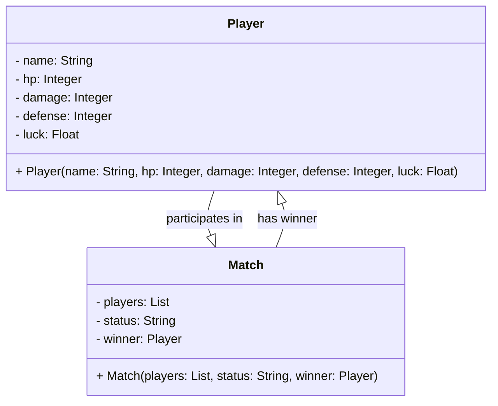

# Java lab for Dio & Santander Bootcamp
Project to validate knowledge acquired in the last bootcamp module. The objective is to create a RESTful API, using Java + Spring Boot and finally deploy it.

## Class Diagram
Below is a small class diagram used as a basis for the project.

